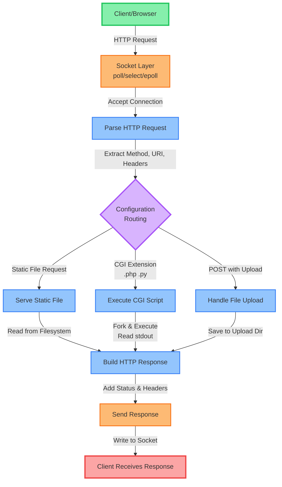

# 42_webserv
HTTP server in C++98

## Split Strategy

### **Person 1: Core Server & I/O**
- **Socket Management & Event Loop**
  - Setup listening sockets (`socket()`, `bind()`, `listen()`)
  - Implement `epoll()` event loop
  - Handle accept new connections
  - Non-blocking I/O operations
  - Client connection management (timeouts, disconnections)

- **HTTP Request Parser**
  - Parse HTTP request line (method, URI, version)
  - Parse headers
  - Handle chunked encoding
  - Handle request body
  - Validate HTTP format

### **Person 2: Config & HTTP Response**
- **Configuration File Parser**
  - Read and parse config file (NGINX-style)
  - Store server settings (ports, error pages, max body size)
  - Store route configurations
  - Validate configuration

- **HTTP Response Builder**
  - Generate response headers
  - Handle status codes (200, 404, 500, etc.)
  - Serve static files (GET)
  - Default error pages
  - Content-Type detection
  - Response formatting

### **Shared/Collaborative Work**

**Both work together on:**
1. **HTTP Methods Implementation**
   - Person 1: POST (file upload handling)
   - Person 2: DELETE (file deletion)
   - Both: GET integration

2. **CGI Execution**
   - Person 1: Process management (`fork()`, `pipe()`, `waitpid()`)
   - Person 2: Environment variables, CGI request/response parsing
   - Both: Integration with main server loop

3. **Integration & Testing**
   - Combine both parts
   - Test with browsers
   - Stress testing
   - Memory leak checking

## Recommended Architecture

```
Person 1 Focus:          Person 2 Focus:
┌──────────────┐         ┌──────────────┐
│ Event Loop   │<────────┤ Config       │
│ (poll/select)│         │ Parser       │
└──────┬───────┘         └──────────────┘
       │
       ↓
┌──────────────┐         ┌──────────────┐
│ Request      │────────>│ Response     │
│ Parser       │         │ Builder      │
└──────────────┘         └──────────────┘
       │                        │
       ↓                        ↓
┌───────────────────────────────────────┐
│             CGI Handler               │
│         (Both work together)          │
└───────────────────────────────────────┘
```


